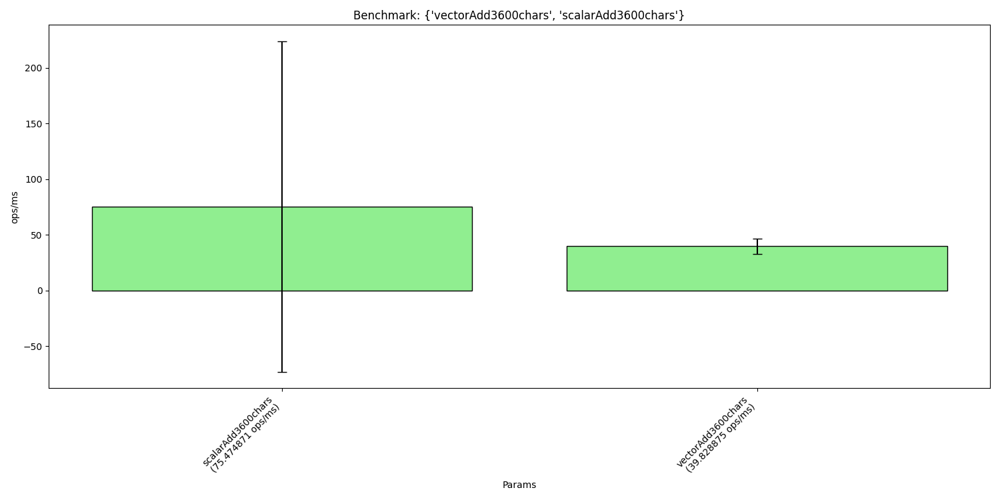
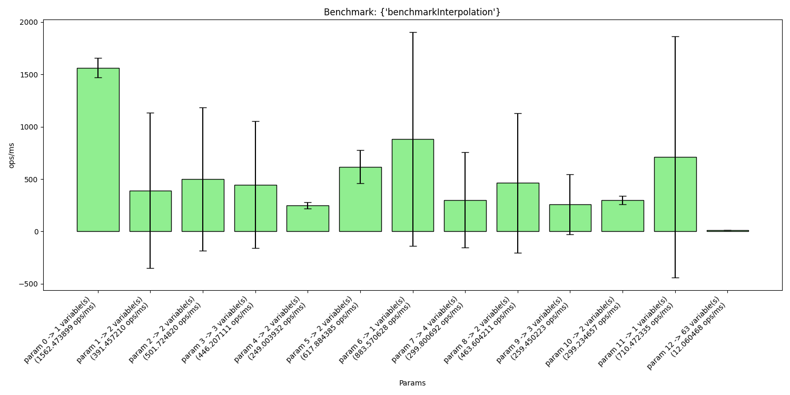
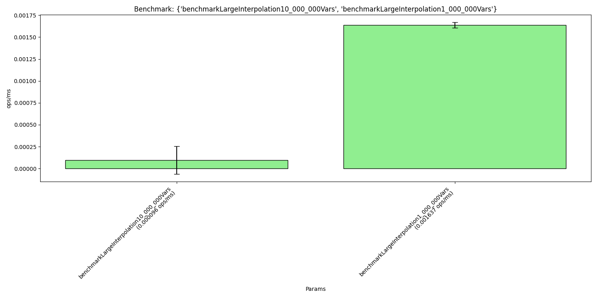

# 🧪 Benchmark Results {#nla-benchmark-results}

| Benchmark                                                                          | Params                                                                                                                                                                                                                                                                                                                                                                                                                                                                                                                                                                                                                                                                                                                                                                                                                                                                                                                                                                                                                                                                                                                                                                                                                                                                                                                                                                                                                                                                                                                                                                                                                                                                                                                                                         | Mode  | Score           | Error            | Units  | Percentiles                                                                                                                                                                                        |
|------------------------------------------------------------------------------------|----------------------------------------------------------------------------------------------------------------------------------------------------------------------------------------------------------------------------------------------------------------------------------------------------------------------------------------------------------------------------------------------------------------------------------------------------------------------------------------------------------------------------------------------------------------------------------------------------------------------------------------------------------------------------------------------------------------------------------------------------------------------------------------------------------------------------------------------------------------------------------------------------------------------------------------------------------------------------------------------------------------------------------------------------------------------------------------------------------------------------------------------------------------------------------------------------------------------------------------------------------------------------------------------------------------------------------------------------------------------------------------------------------------------------------------------------------------------------------------------------------------------------------------------------------------------------------------------------------------------------------------------------------------------------------------------------------------------------------------------------------------|-------|-----------------|------------------|--------|----------------------------------------------------------------------------------------------------------------------------------------------------------------------------------------------------|
| `StringUtilsBenchmark.scalarAdd3600chars`                                          | -                                                                                                                                                                                                                                                                                                                                                                                                                                                                                                                                                                                                                                                                                                                                                                                                                                                                                                                                                                                                                                                                                                                                                                                                                                                                                                                                                                                                                                                                                                                                                                                                                                                                                                                                                              | thrpt | 75.4748708349   | ±148.3952627318  | ops/ms | P0.0=52.043525, P50.0=53.728051, P90.0=141.854764, P95.0=141.854764, P99.0=141.854764, P99.9=141.854764, P99.99=141.854764, P99.999=141.854764, P99.9999=141.854764, P100.0=141.854764             |
| `StringUtilsBenchmark.vectorAdd3600chars`                                          | -                                                                                                                                                                                                                                                                                                                                                                                                                                                                                                                                                                                                                                                                                                                                                                                                                                                                                                                                                                                                                                                                                                                                                                                                                                                                                                                                                                                                                                                                                                                                                                                                                                                                                                                                                              | thrpt | 39.8288747925   | ±7.0061680097    | ops/ms | P0.0=38.199916, P50.0=39.075611, P90.0=42.833616, P95.0=42.833616, P99.0=42.833616, P99.9=42.833616, P99.99=42.833616, P99.999=42.833616, P99.9999=42.833616, P100.0=42.833616                     |
| `StringInterpolatorBenchmark.benchmarkInterpolation`                               | input=مرحباً \${الاسم}                                                                                                                                                                                                                                                                                                                                                                                                                                                                                                                                                                                                                                                                                                                                                                                                                                                                                                                                                                                                                                                                                                                                                                                                                                                                                                                                                                                                                                                                                                                                                                                                                                                                                                                                         | thrpt | 1562.4738989733 | ±92.6870878596   | ops/ms | P0.0=1522.237726, P50.0=1569.447379, P90.0=1582.940839, P95.0=1582.940839, P99.0=1582.940839, P99.9=1582.940839, P99.99=1582.940839, P99.999=1582.940839, P99.9999=1582.940839, P100.0=1582.940839 |
| `StringInterpolatorBenchmark.benchmarkInterpolation`                               | input=أهلاً \${الاسم}، لديك \${عدد_الرسائل} رسالة جديدة                                                                                                                                                                                                                                                                                                                                                                                                                                                                                                                                                                                                                                                                                                                                                                                                                                                                                                                                                                                                                                                                                                                                                                                                                                                                                                                                                                                                                                                                                                                                                                                                                                                                                                        | thrpt | 391.4572104271  | ±740.8739795258  | ops/ms | P0.0=283.364376, P50.0=307.584200, P90.0=733.105851, P95.0=733.105851, P99.0=733.105851, P99.9=733.105851, P99.99=733.105851, P99.999=733.105851, P99.9999=733.105851, P100.0=733.105851           |
| `StringInterpolatorBenchmark.benchmarkInterpolation`                               | input=البريد الإلكتروني: \${البريد_الإلكتروني}، الرصيد: \${الرصيد} ريال                                                                                                                                                                                                                                                                                                                                                                                                                                                                                                                                                                                                                                                                                                                                                                                                                                                                                                                                                                                                                                                                                                                                                                                                                                                                                                                                                                                                                                                                                                                                                                                                                                                                                        | thrpt | 501.7248196943  | ±683.3211300238  | ops/ms | P0.0=262.881691, P50.0=585.474522, P90.0=659.524842, P95.0=659.524842, P99.0=659.524842, P99.9=659.524842, P99.99=659.524842, P99.999=659.524842, P99.9999=659.524842, P100.0=659.524842           |
| `StringInterpolatorBenchmark.benchmarkInterpolation`                               | input=مرحبا \${الاسم_الأول} \${الاسم_الأخير}، رقم المستخدم: \${معرف_المستخدم}                                                                                                                                                                                                                                                                                                                                                                                                                                                                                                                                                                                                                                                                                                                                                                                                                                                                                                                                                                                                                                                                                                                                                                                                                                                                                                                                                                                                                                                                                                                                                                                                                                                                                  | thrpt | 446.2071106121  | ±605.2235485732  | ops/ms | P0.0=286.730936, P50.0=442.803119, P90.0=697.258029, P95.0=697.258029, P99.0=697.258029, P99.9=697.258029, P99.99=697.258029, P99.999=697.258029, P99.9999=697.258029, P100.0=697.258029           |
| `StringInterpolatorBenchmark.benchmarkInterpolation`                               | input=مرحباً بك، يا \${الاسم}! لقد أرسلت \${عدد_الرسائل} رسائل اليوم.                                                                                                                                                                                                                                                                                                                                                                                                                                                                                                                                                                                                                                                                                                                                                                                                                                                                                                                                                                                                                                                                                                                                                                                                                                                                                                                                                                                                                                                                                                                                                                                                                                                                                          | thrpt | 249.0039321534  | ±29.4616237254   | ops/ms | P0.0=241.914921, P50.0=247.361221, P90.0=261.826523, P95.0=261.826523, P99.0=261.826523, P99.9=261.826523, P99.99=261.826523, P99.999=261.826523, P99.9999=261.826523, P100.0=261.826523           |
| `StringInterpolatorBenchmark.benchmarkInterpolation`                               | input=القيمة: \${مصفوفة_ترابطية["القيمة"]} يجب أن تكون مساوية لـ \${المتوقع}.                                                                                                                                                                                                                                                                                                                                                                                                                                                                                                                                                                                                                                                                                                                                                                                                                                                                                                                                                                                                                                                                                                                                                                                                                                                                                                                                                                                                                                                                                                                                                                                                                                                                                  | thrpt | 617.8843853901  | ±157.7722684810  | ops/ms | P0.0=546.517544, P50.0=632.011402, P90.0=648.350345, P95.0=648.350345, P99.0=648.350345, P99.9=648.350345, P99.99=648.350345, P99.999=648.350345, P99.9999=648.350345, P100.0=648.350345           |
| `StringInterpolatorBenchmark.benchmarkInterpolation`                               | input=المبلغ الإجمالي: \${المبلغ_الإجمالي} د.إ                                                                                                                                                                                                                                                                                                                                                                                                                                                                                                                                                                                                                                                                                                                                                                                                                                                                                                                                                                                                                                                                                                                                                                                                                                                                                                                                                                                                                                                                                                                                                                                                                                                                                                                 | thrpt | 883.5706277750  | ±1021.2988223646 | ops/ms | P0.0=453.171398, P50.0=1031.641416, P90.0=1068.566924, P95.0=1068.566924, P99.0=1068.566924, P99.9=1068.566924, P99.99=1068.566924, P99.999=1068.566924, P99.9999=1068.566924, P100.0=1068.566924  |
| `StringInterpolatorBenchmark.benchmarkInterpolation`                               | input=عزيزي \${الاسم}، تم تسجيل الدخول من الجهاز \${الجهاز} في الساعة \${الوقت} بتاريخ \${التاريخ}.                                                                                                                                                                                                                                                                                                                                                                                                                                                                                                                                                                                                                                                                                                                                                                                                                                                                                                                                                                                                                                                                                                                                                                                                                                                                                                                                                                                                                                                                                                                                                                                                                                                            | thrpt | 299.8006924852  | ±455.1387611282  | ops/ms | P0.0=188.495502, P50.0=268.414241, P90.0=452.611372, P95.0=452.611372, P99.0=452.611372, P99.9=452.611372, P99.99=452.611372, P99.999=452.611372, P99.9999=452.611372, P100.0=452.611372           |
| `StringInterpolatorBenchmark.benchmarkInterpolation`                               | input=مرحبا \${الاسم}، \${الاسم}، كيف حالك؟                                                                                                                                                                                                                                                                                                                                                                                                                                                                                                                                                                                                                                                                                                                                                                                                                                                                                                                                                                                                                                                                                                                                                                                                                                                                                                                                                                                                                                                                                                                                                                                                                                                                                                                    | thrpt | 463.6042112102  | ±665.0657913112  | ops/ms | P0.0=377.957018, P50.0=381.364675, P90.0=771.793690, P95.0=771.793690, P99.0=771.793690, P99.9=771.793690, P99.99=771.793690, P99.999=771.793690, P99.9999=771.793690, P100.0=771.793690           |
| `StringInterpolatorBenchmark.benchmarkInterpolation`                               | input=«\${الاسم}» قام بعملية شراء بمبلغ «\${المبلغ}» في {\${المكان}}\$.                                                                                                                                                                                                                                                                                                                                                                                                                                                                                                                                                                                                                                                                                                                                                                                                                                                                                                                                                                                                                                                                                                                                                                                                                                                                                                                                                                                                                                                                                                                                                                                                                                                                                        | thrpt | 259.4502232284  | ±288.3700410224  | ops/ms | P0.0=223.148337, P50.0=227.352679, P90.0=393.363874, P95.0=393.363874, P99.0=393.363874, P99.9=393.363874, P99.99=393.363874, P99.999=393.363874, P99.9999=393.363874, P100.0=393.363874           |
| `StringInterpolatorBenchmark.benchmarkInterpolation`                               | input=البيانات غير مكتملة: \${العمر} سنة، الحالة: \${الحالة}                                                                                                                                                                                                                                                                                                                                                                                                                                                                                                                                                                                                                                                                                                                                                                                                                                                                                                                                                                                                                                                                                                                                                                                                                                                                                                                                                                                                                                                                                                                                                                                                                                                                                                   | thrpt | 299.2346566093  | ±40.9014353967   | ops/ms | P0.0=287.134576, P50.0=303.966341, P90.0=310.575633, P95.0=310.575633, P99.0=310.575633, P99.9=310.575633, P99.99=310.575633, P99.999=310.575633, P99.9999=310.575633, P100.0=310.575633           |
| `StringInterpolatorBenchmark.benchmarkInterpolation`                               | input=اسم العميل: \${الاسم:غير معروف}                                                                                                                                                                                                                                                                                                                                                                                                                                                                                                                                                                                                                                                                                                                                                                                                                                                                                                                                                                                                                                                                                                                                                                                                                                                                                                                                                                                                                                                                                                                                                                                                                                                                                                                          | thrpt | 710.4723354940  | ±1152.7306323953 | ops/ms | P0.0=492.869089, P50.0=508.462857, P90.0=1148.291377, P95.0=1148.291377, P99.0=1148.291377, P99.9=1148.291377, P99.99=1148.291377, P99.999=1148.291377, P99.9999=1148.291377, P100.0=1148.291377   |
| `StringInterpolatorBenchmark.benchmarkInterpolation`                               | input=اسم الموظف: \${اسم_الموظف}, المسمى الوظيفي: \${المسمى_الوظيفي}, القسم: \${القسم}, الراتب الأساسي: \${الراتب_الأساسي} ريال،بدل السكن: \${بدل_السكن}، بدل النقل: \${بدل_النقل}، مجموع البدلات: \${مجموع_البدلات}،الخصومات: \${الخصومات}، صافي الراتب: \${صافي_الراتب}، تاريخ الانضمام: \${تاريخ_الانضمام}، رقم الموظف: \${رقم_الموظف}،عدد الأيام: \${عدد_الأيام}، ساعات العمل: \${ساعات_العمل}، حالة الموظف: \${الحالة}،البريد الإلكتروني: \${البريد_الإلكتروني}, رقم الهاتف: \${رقم_الهاتف}،اسم البنك: \${اسم_البنك}, رقم الحساب: \${رقم_الحساب}،مشروع 1: \${مشروع_١}, مشروع 2: \${مشروع_٢}, مشروع 3: \${مشروع_٣}،تقييم الأداء: \${تقييم_الأداء}, ملاحظات: \${ملاحظات}،توقيع المدير: \${توقيع_المدير}, توقيع الموظف: \${توقيع_الموظف}،بند 1: \${بند_١}, بند 2: \${بند_٢}, بند 3: \${بند_٣}, بند 4: \${بند_٤}, بند 5: \${بند_٥}،قسم 1: \${قسم_١}, قسم 2: \${قسم_٢}, قسم 3: \${قسم_٣}, قسم 4: \${قسم_٤}, قسم 5: \${قسم_٥}،متغير إضافي 1: \${متغير_١}, متغير إضافي 2: \${متغير_٢}, متغير إضافي 3: \${متغير_٣}،متغير إضافي 4: \${متغير_٤}, متغير إضافي 5: \${متغير_٥}،رسالة: \${رسالة}, ملاحظة: \${ملاحظة}, نوع العقد: \${نوع_العقد}, فترة التجربة: \${فترة_التجربة}،الرصيد السنوي: \${الرصيد_السنوي}, الرصيد المرضي: \${الرصيد_المرضي}, الرصيد المتبقي: \${الرصيد_المتبقي}،العنوان: \${العنوان}, المدينة: \${المدينة}, الدولة: \${الدولة}،معرف النظام: \${معرف_النظام}, نوع النظام: \${نوع_النظام}, الإصدار: \${الإصدار}،معرف البصمة: \${معرف_البصمة}, الرمز الداخلي: \${الرمز_الداخلي}, رقم الملف: \${رقم_الملف}،آخر تحديث: \${آخر_تحديث}, محدث بواسطة: \${محدث_بواسطة}, الحالة الحالية: \${الحالة_الحالية}،الراتب بعد التعديل: \${الراتب_بعد_التعديل}, تاريخ التعديل: \${تاريخ_التعديل}،تصنيف الأداء: \${تصنيف_الأداء}, ملاحظات الأداء: \${ملاحظات_الأداء} | thrpt | 12.0604679916   | ±1.4218176757    | ops/ms | P0.0=11.613529, P50.0=11.997086, P90.0=12.552421, P95.0=12.552421, P99.0=12.552421, P99.9=12.552421, P99.99=12.552421, P99.999=12.552421, P99.9999=12.552421, P100.0=12.552421                     |
| `StringInterpolatorLargeInputsBenchmark.benchmarkLargeInterpolation10_000_000Vars` | -                                                                                                                                                                                                                                                                                                                                                                                                                                                                                                                                                                                                                                                                                                                                                                                                                                                                                                                                                                                                                                                                                                                                                                                                                                                                                                                                                                                                                                                                                                                                                                                                                                                                                                                                                              | thrpt | 0.0000961367    | ±0.0001602919    | ops/ms | P0.0=0.000053, P50.0=0.000086, P90.0=0.000142, P95.0=0.000142, P99.0=0.000142, P99.9=0.000142, P99.99=0.000142, P99.999=0.000142, P99.9999=0.000142, P100.0=0.000142                               |
| `StringInterpolatorLargeInputsBenchmark.benchmarkLargeInterpolation1_000_000Vars`  | -                                                                                                                                                                                                                                                                                                                                                                                                                                                                                                                                                                                                                                                                                                                                                                                                                                                                                                                                                                                                                                                                                                                                                                                                                                                                                                                                                                                                                                                                                                                                                                                                                                                                                                                                                              | thrpt | 0.0016373233    | ±0.0000303045    | ops/ms | P0.0=0.001627, P50.0=0.001637, P90.0=0.001645, P95.0=0.001645, P99.0=0.001645, P99.9=0.001645, P99.99=0.001645, P99.999=0.001645, P99.9999=0.001645, P100.0=0.001645                               |

---

## 📈 Benchmark Graphs

### StringUtilsBenchmark comparison {#nla-StringUtilsBenchmark-benchmark}

### StringInterpolatorBenchmark comparison {#nla-StringInterpolatorBenchmark-benchmark}

### StringInterpolatorLargeInputsBenchmark comparison {#nla-StringInterpolatorLargeInputsBenchmark-benchmark}

---